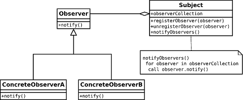
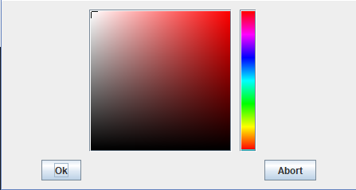

# Rapport de projet Java :  Application de dessin vectoriel (ébauche)

# Pain-t
<!--  -->

## Fonctionnalités du prototype
L'application a été développée selon le cahier des charges et les fonctionnalités bonus ont été reprises de l'application Microsoft Paint.

Voici la liste exhaustive des fonctionnalités :
* Sélection :
   * Sélection de la forme au *clic* ;
   * Sélection de plusieurs formes en appuyant sur **Shift** tout en *cliquant* sur les formes ;
   * Sélection des formes au lasso (*cliquer et faire glisser*) ;
   * Sélection de toutes les formes via **Ctrl + A** ;
   * Navigation et sélection des formes via **Tab** ;
   * Désélection de toutes les formes sélectionnées via **Echap** ;
* Déplacement :
   *  Déplacement des formes sélectionnées en *cliquant* et *faisant glisser* ;
   *  Déplacement des formes sélectionnées via les *flèches du clavier* ;
* Création des formes à la volée ;
* Modification :
   * Modification des attributs des formes à la volée ;
   * Redimensionnement des formes via les *handlers* ;
   * Pivot de 90° des formes sélectionnées ;
   * Changement de plan d'un figure ;
* Sauvegarde :
   * Sauvegarde sous le format d'une image ;
   * Sauvegarde sous l'image d'un script (afin de reprendre l'édition du projet) ;
   * Chargement du script ;
* Outils :
   * Zoom du canevas (pas de modification de la taille des formes)

### Raccourcis clavier :
   * **Ctrl + A** : Sélection de toutes les formes ;
   * **Tab** : Navigation et sélection des formes ;
   * **Echap** : Désélection de toutes les formes sélectionnées ;
   * **Suppr** : Suppression des formes sélectionnées ;
   * **Ctrl + C** : Copie des formes sélectionnées ;
   * **Ctrl + V** : Collage des formes copiées ;
   * **Ctrl + X** : Copie et collage des formes sélectionnées ;
   * **Flèches du clavier** : Déplacement les formes sélectionnées ;
   * **P** : Pivot de 90° des formes sélectionnées ;
   * **1** : Met la dernière forme sélectionnée à un plan plus proche ;
   * **2** : Met la dernière forme sélectionnée à un plan plus éloigné ;

## Choix de l'implantation

### Gestion de l'interface

Dans le projet initial, le modèle ne notifiait pas la vue d'un éventuel changement. La première modification a donc été de rajouter cette fonctionnalité. Pour se faire, la classe [**ShapeModel**](./src/graphics/shapes/ShapeModel.java) a été ajoutée. Elle contient notamment la création des différentes formes de base et la récupération de ces formes.

La classe **Shape** et la classe **Attributes** implémentent toutes les deux l'interface **Observable**, celle-ci permettant d'ajouter des observateurs.
Les méthodes de modification de ces classes appellent la méthode **notifyObservers()**, qui appelle à son tour la méthode **notify()** de l'observer, qui raffraichit la fenêtre pour mettre à jour la vue.

Afin de supporter les nouvelles fonctionnalités, l'interface a subit de nombreux changements (développement par *Nicolas Herr*).
Pour pouvoir modifier plus facilement les shapes, un bandeau de contrôle a été ajouté.

Il est décomposé en trois **JPanel**.
* Le panel pour la création de formes de base.
* Le panel pour la modification des couleurs des formes.
* Le panel de modification des attributs du texte.

Dans le premier **JPanel**, les formes sont créées. [Voir Partie leslie](#leslie)

Dans le second **JPanel**, nous avons tous les modificateurs liés à la couleurs. Lors d'un clic sur une formes, les éléments s'adaptent en fonction de la forme selectionnée. Si la couleur de remplissage est activée, la **JCheckBox** est cochée.
Le bouton de remplissage et le bouton de contour, sont des **JButton** customisés.
La méthode [**paintComponent()**](./src/shapes/ui/component/ButtonColor.java#L58) a été réécrite. Le petit rectangle gris sur l'image indique la couleur en cours.

Lors du clic sur un bouton, un menu **JPopupMenu** s'ouvre. Cette popup contient un élément permettant de choisir la couleur voulue ainsi qu'un bouton de validation et un d'abandon.  
Le sélectionneur de couleur est un **JColorChooser** customisé [voir **ColorChooser**](./src/graphics/shapes/ui/component/ColorChooser.java).

* Un curseur en forme de croix permet de choisir la couleur. Différentes couleurs sont disponibles en cliquant sur la colonne de couleur sur la droite.  
* Le bouton **OK** permet d'appliquer la couleur à la forme sélectionnée.
* Le bouton **ABORT** permet de fermer la popup sans rien modifier.

La réalisation de ce sélecteur de couleur a posé quelques problèmes. En effet, le composant JColorChooser est un sélecteur générique avec beaucoup trop de fonctionnalités pour les actions que nous voulions. J'ai donc voulu dans un premier temps créer notre propre sélecteur de couleur. Après avoir passé du temps à essayer de créer ce selecteur de couleur sans succès, j'ai décidé de prendre uniquement le rectangle de couleur. Le problème est que la classe est protégée. Il est donc impossible de l'instancier depuis notre projet. J'ai donc dû créer un JColorChooser et enlever les parties qui ne m'intéressaient pas : les différents onglets et le panel de prévisualisation.
Dans l'onglet restant, il restait les barres contenant la valeur des composantes RGB. Étant assez encombrantes, je les ai également enlevées. Après avoir récupéré ce composant, je l'ai ajouté dans un JPopupMenu. J'ai choisi de le mettre dans ce composant : je ne souhaitais pas le mettre dans une nouvelle JFrame. Le JPopupMenu est plus compact et impacte moins sur la visualisation des formes dans l'interface. Dans le JPopupMenu se trouve un panel contenant un GridBagLayout. Ce qui me permet de placer les éléments facilement.

Dans le dernier, il y a tous les modificateurs liés à la police de texte. Comme le JPanel de choix de couleurs, les attributs se mettent à jour automatiquement lors d'un clic sur une forme de type texte. Nous avons la possibilité de modifier trois paramètres de la police.

* La police : toutes les polices disponibles de l'ordinateur y sont présentes.
* La taille de la police : de 10 à 38px.
* La couleur de la police.

La police et la taille sont dans deux listes déroulantes. Une fois un texte selectionné, on peut changer ses attributs. Le changement se fait lors de la selection d'un nouvel élément de la liste à l'aide d'un **ActionListener**.

### Sélection et changement des tailles des formes

#### Formes retenues
Les formes retenues sont le **SRectangle**, le **SOval**, le **SText**, le **SLine** et la **SCollection**. Le SCircle a été remplacé par le SOval, puisque plus logique au niveau du programme. En effet, l'objet **Graphics2D**, au niveau du **ShapesDraftman**, dessine les formes selon leurs limites, selon le cadre les contenant(*bounds*). Ainsi, en implantant le SOval comme une classe fille de SRectangle, SOval peut hériter de ses comportements (comme le redimensionnement via les handlers).

#### Sélection

Nous avons décidé d'ajouter le lasso afin de pouvoir sélectionner plusieurs formes au clic. Pour faire ceci, il faut créer l'objet spécial lasso, et notifier le ShapesView à chaque fois qu'il y a un redimensionnement. Cet outil a une fonctionnalité dédiée au niveau du ShapesDraftman pour l'afficher. Effectivement, le lasso n'a pas d'attribut de sélection et possède l'affichage différent d'un SRectangle classique.

Lors de son utilisation, il faut faire attention à utiliser la version absolue des limites du lasso, car le rectangle n'est pas valide avec une largeur et/ou une hauteur négatives. Après, il suffit de récupérer les formes dont la limite (*bounds*) possède une interction avec le lasso.

#### Redimensionnement

Chaque forme possède des carrés dans ses coins afin de pouvoir les redimensionner. Les formes redimensionnables sont le **SRectangle**, le **SOval**, le **SLine** et la **SCollection**. Le **SText** n'est pas redimensionnable, puisque la taile passe par l'attribut *Font*.

Au début, nous hésitions entre le redimensionnement propotionnel et non-proportionnel, nous avons choisi la dernière solution. Il est impossible de redimensionner un rectangle avec des dimensions largeur et hauteur non proportionnelles entre elles (exemple: hauteur : 3px, largeur: 10px), puisque le **Graphics2D** du **ShapesDraftman** ne prend en paramètre que des largeurs et hauteurs entières.
Nous sommes donc restés avec la solution de l'application Microsoft Paint, c'est-à-dire redimensionner non-proportionnellement les formes, en les sélectionnant par leurs coins. Comme ladite application, il est impossible de mettre les formes en taille négative.

#### Pivot

Au début, nous utilisions la fonction **rotate** du **Graphics2D** du **ShapesDraftman** pour pivoter les formes, mais il était impossible de sélectionner les formes aux zones changeantes. Ce problème a été réglé en changeant les dimensions de formes (exemple: un rectangle de 3px de haut et 10px de large devient un rectangle de 3px de large et 10px de haut). Il est impossible de pivoter proprement les SText. Il est possible de donner l'illusion du pivot à 180° en passant la taille de la police en négatif. Toutefois, toutes les versions de Java ne supportent pas la taille de police négative, et ce n'est pas convenable.

#### Changement de plan d'une figure

Etant donné que les formes s'affichent dans l'ordre de la liste **model** (premier index : forme au dernier plan, ..., dernier index : forme au premier plan), il suffit de changer l'ordre dans la liste pour pouvoir passer les formes à un certain plan.

### Sauvegarde et lecture des fichiers
**JN, tu écriras ton bordel. **

### 

### Création des formes et modification des attributs
**Leslie, tu écriras ton bordel. **

## Créateurs
* Nicolas Herr ;
* Manon Heyser ;
* Jean-Noël Balanche ;
* Leslie Caron.
