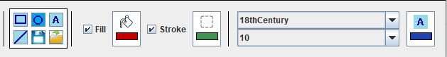

# Rapport de projet Java :  Application de dessin vectoriel (ébauche)

# Pain-t
<!--  -->

## Fonctionnalités du prototype
L'application a été développée selon le cahier des charges et les fonctionnalités bonus ont été reprises de l'application Microsoft Paint.

Voici la liste exhaustive des fonctionnalités :
* Sélection :
   * Sélection de la forme au click ;
   * Sélection de plusieurs formes en appuyant sur **Shift** tout en cliquant sur les formes ;
   * Sélection des formes au lasso (click and drag) ;
   * Sélection de toutes les formes via **Ctrl + A** ;
   * Navigation et sélection des formes via **Tab** ;
   * Désélection de toutes les formes sélectionnées via **Echap** ;
* Déplacement :
   *  Déplacement des formes sélectionnées au click and drag ;
   *  Déplacement des formes sélectionnées via les flèches du clavier ;
* Création des formes à la volée ;
* Modification :
   * Modification des attributs des formes à la volée ;
   * Redimensionnement des formes via les *handlers* ;
   * Pivot de 90° des formes sélectionnées ;
   * Changement de plan d'un figure ;
* Sauvegarde :
   * Sauvegarde sous le format d'une image ;
   * Sauvegarde sous l'image d'un script (afin de reprendre l'édition du projet) ;
   * Chargement du script ;
* Outils :
   * Zoom du canevas (pas de modification de la taille des formes)

### Raccourcis clavier :
   * **Ctrl + A** : Sélection de toutes les formes ;
   * **Tab** : Navigation et sélection des formes ;
   * **Echap** : Désélection de toutes les formes sélectionnées ;
   * **Suppr** : Suppression des formes sélectionnées ;
   * **Ctrl + C** : Copie des formes sélectionnées ;
   * **Ctrl + V** : Collage des formes copiées ;
   * **Ctrl + X** : Copie et collage des formes sélectionnées ;
   * **Flèches du clavier** : Déplacement les formes sélectionnées ;
   * **P** : Pivot de 90° des formes sélectionnées ;
   * **1** : Met la dernière forme sélectionnée à un plan plus proche ;
   * **2** : Met la dernière forme sélectionnée à un plan plus éloigné ;

## Choix de l'implantation

Dans le projet initial, le modèle ne notifiait pas la vue d'un éventuel changement. La première modification a donc été de rajouter cette fonctionnalité. Pour ce faire, la classe [**ShapeModel**](./src/graphics/shapes/ShapeModel.java) a été ajouté. Elle contient notemment la création des différentes formes de base et la récupération de ces formes.

La classe **Shape** et la classe **Attributes** implémentes toutes deux l'interface **Observable** permettant d'ajouter des observateur.
Les méthodes de modifications de ces classes apellent la méthode **notifyObservers()** qui apelle a son tour la méthode **notify()** de l'observer, qui raffraichit la fênetre pour mettre à jour la vue.

**Nico, tu écriras ton bordel. **
Afin de supporter les nouvelles fonctionnalités, l'interface a subit de nombreux changement (développement par *Nicolas Herr*).
Pour pouvoir modifier plus facilement les shapes, un bandeau de contrôle a été ajouté.

Il est décomposé en trois **JPanel**.
* Le panel pour la création de formes de bases.
* Le panel pour la modification des couleurs des formes.
* Le panel de modification des attributs texte.

Dans le premier **JPanel**, les formes sont créés. [Voir Partie leslie](#leslie)

Dans le second, nous avons toutes les modificateurs liées à la couleurs. Lors d'un click sur une formes, les éléments vont s'adapter en fonction de la forme selectionnée. Si la couleur de remplissage est activé, la **JCheckBox** sera cochée.
Le bouton de remplissage et le bouton de contour, sont des **JButton** customisés.
La méthode [**paintComponent()**](./src/shapes/ui/component/ButtonColor.java#L58) a été réécrite. Le petit rectangle gris sur l'image indique la couleur en cours.

Lors du click sur un bouton, un menu **JPopupMenu** s'ouvre. Cette popup contient un élément permettant de choisir la couleur voulu ainsi qu'un bouton de validation et un d'abandon.  
Le selectionneur de couleur est un **JColorChooser** customisé [voir **ColorChooser**](./src/graphics/shapes/ui/component/ColorChooser.java).

* Un curseur en forme de croix permet de choisir la couleur. Différentes couleurs sont disponible en cliquant sur la colonne de couleur sur la droite.  
* Le bouton **OK** permet  d'appliquer la couleur a la forme selectionnée.
* Le bouton **ABORT** permet de fermer la popup sans rien modifier.

La réalisation de ce selecteur de couleur a posé quelques problèmes. En effet le composant JColorChooser est un sélecteur générique avec beaucoup trop de fonctionnalités pour les actions que nous voulions. J'ai donc voulu dans un premier temps créé mon propre sélecteur de couleur. Après avoir passé du temps, sans succès, a essayer de créé  ce selecteur de couleur, j'ai décidé de prendre uniquement le rectangle de couleur. Le problème est que la classe est protégé. Donc impossible de l'instancier depuis notre projet. J'ai donc du créé un JColorChooser et d'enlever les parties qui ne m'intéressait pas : les différents onglets et le panel de prévisualisation.
Dans l'onglet restant il restait les barres contenant la valeur des composnates RGB. Étant assez encombrante, je les ais également enlever. Après avoir récupérer ce composant, je l'ai ajouter dans un JPopupMenu. J'ai choisi de le mettre dans ce composant je ne souhaitait pas le mettre dans une nouvelle JFrame. Le JPopupMenu est plus compact et impact moins sur la visualisation des formes dans l'interface. Dans le JPopupMenu ce trouve un panel contenant un GridBagLayout. Ce qui me permet de placer mes éléments facilement.

Dans le dernier, il ya tous les modificateurs liée a la police de texte. Comme le JPanel couleur, les attributs se mettent à jour automatiquement lors d'un click sur une forme de type texte. Nous avons la possibilité de modifier trois paramètres de la police.

* La police toutes les polices disponible de l'ordinateur y sont présente.
* La taille de la police : de 10 a 38.
* La couleur de la police.

La police et la taille sont dans deux liste déroulante. Une fois un texte selectionné, on peux changer ses attributs. Le changement se fait lors de la selection d'un nouvel élément de la liste à l'aide d'un **ActionListener**.

**Manon, tu écriras ton bordel. **
Les formes retenues sont le **SRectangle**, le **SOval**, le **SText** et la **SCollection**. Le SCircle a été remplacé par le SOval, puisque plus logique au niveau du programme. L'objet **Graphics2D** au niveau du **ShapesDraftman** dessine les formes selon leurs limites, selon le cadre les contenant. Ainsi, en implantant le SOval comme une classe fille de SRectangle, SOval peut hériter de ses comportements (comme le redimensionnement via les handlers).

**JN, tu écriras ton bordel. **

### 

**Leslie, tu écriras ton bordel. **

## Créateurs
* Nicolas Herr ;
* Manon Heyser ;
* Jean-Noël Balanche ;
* Leslie Caron.
